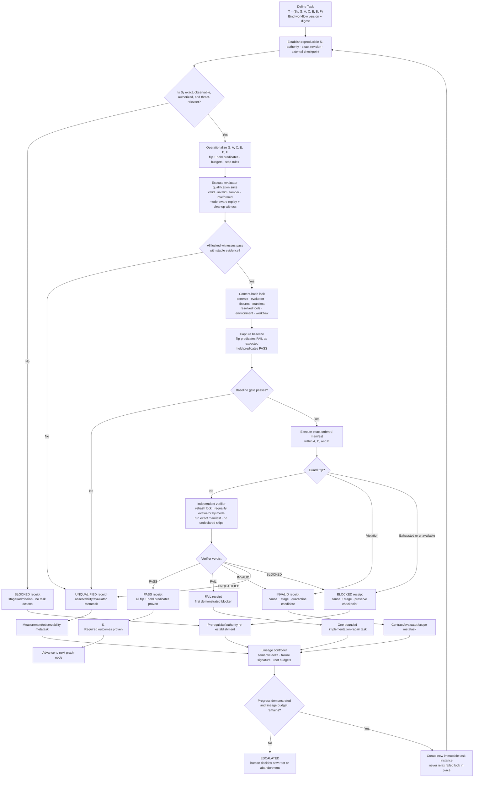

Task E2E Workflow Definition v1.0.0 (September 1, 2026 13:32 CST)

```mermaid
flowchart TD
    T["Define Task<br/>T = (S₀, G, A, C, E, B, F)<br/>Bind workflow version + digest"] --> S0["Establish reproducible S₀<br/>authority · exact revision · external checkpoint"]
    S0 --> Q0{"Is S₀ exact, observable,<br/>authorized, and threat-relevant?"}

    Q0 -- "No" --> BR["BLOCKED receipt<br/>stage=admission · no task actions"]
    Q0 -- "Yes" --> CONTRACT["Operationalize G, A, C, E, B, F<br/>flip + hold predicates · budgets · stop rules"]

    CONTRACT --> QE["Execute evaluator qualification suite<br/>valid · invalid · tamper · malformed<br/>mode-aware replay + cleanup witness"]
    QE --> QQ{"All locked witnesses pass<br/>with stable evidence?"}

    QQ -- "No" --> UR["UNQUALIFIED receipt<br/>observability/evaluator metatask"]
    QQ -- "Yes" --> LOCK["Content-hash lock<br/>contract · evaluator · fixtures · manifest<br/>resolved tools · environment · workflow"]

    LOCK --> BASE["Capture baseline<br/>flip predicates FAIL as expected<br/>hold predicates PASS"]
    BASE --> QB{"Baseline gate passes?"}

    QB -- "No" --> UR
    QB -- "Yes" --> EXEC["Execute exact ordered manifest<br/>within A, C, and B"]

    EXEC --> GUARD{"Guard trip?"}
    GUARD -- "No" --> VERIFY["Independent verifier<br/>rehash lock · requalify evaluator by mode<br/>run exact manifest · no undeclared skips"]
    GUARD -- "Violation" --> IR["INVALID receipt<br/>cause + stage · quarantine candidate"]
    GUARD -- "Exhausted or unavailable" --> XR["BLOCKED receipt<br/>cause + stage · preserve checkpoint"]

    VERIFY --> VERDICT{"Verifier verdict"}
    VERDICT -- "PASS" --> PR["PASS receipt<br/>all flip + hold predicates proven"]
    VERDICT -- "FAIL" --> FR["FAIL receipt<br/>first demonstrated blocker"]
    VERDICT -- "INVALID" --> IR
    VERDICT -- "UNQUALIFIED" --> UR
    VERDICT -- "BLOCKED" --> XR

    PR --> SN["Sₙ<br/>Required outcomes proven"]
    SN --> ADVANCE["Advance to next graph node"]

    FR --> IMP["One bounded implementation-repair task"]
    IR --> META["Contract/evaluator/scope metatask"]
    UR --> OBS["Measurement/observability metatask"]
    XR --> PRE["Prerequisite/authority re-establishment"]
    BR --> PRE

    IMP --> LC["Lineage controller<br/>semantic delta · failure signature · root budgets"]
    META --> LC
    OBS --> LC
    PRE --> LC

    LC --> QL{"Progress demonstrated<br/>and lineage budget remains?"}
    QL -- "No" --> ESC["ESCALATED<br/>human decides new root or abandonment"]
    QL -- "Yes" --> NEW["Create new immutable task instance<br/>never relax failed lock in place"]
    NEW --> S0
```